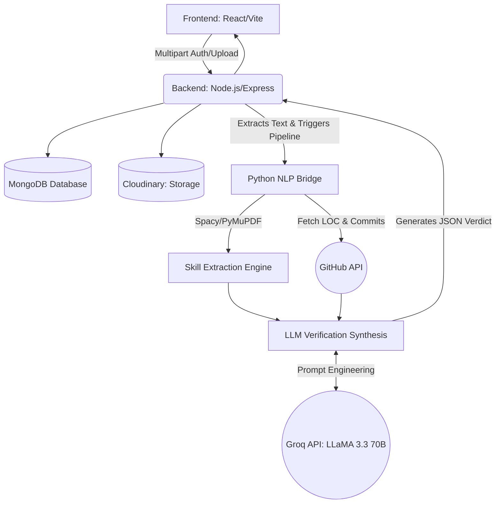

# SkillProof 🚀

**SkillProof** is a next-generation neural verification pipeline that bridges the gap between claimed skills on a resume and real-world engineering telemetry from GitHub. Using state-of-the-art LLM synthesis (LLaMA 3.3 70B via Groq), the platform audits GitHub repositories to algorithmically verify if a candidate's stated skills are *Proven*, *Plausible*, or *Overstated*.

## 🏗️ System Architecture

The ecosystem relies on an inter-service architecture where a Node.js API orchestrates heavily contextualized AI verification cycles via integrated Python subsystems.



---

## ⚙️ The Verification Workflow (Data Pipeline)

1. **Initialization:** The user authenticates (JWT encoded in secure HTTP-only cookies) and uploads a Resume (PDF/DOCX). Optionally, a GitHub URL mapping can be provided.
2. **Text Digestion:** Multiparts hit the Node Backend, are saved locally, and trigger a Python subprocess via `child_process`.
3. **Skill Entity Extraction:** The Python backend parses the document using `PyMuPDF` and `Spacy NLP` to cluster and identify structured technical skills.
4. **Telemetry Audit:** For the extracted entities, `requests` dynamically fetch matching repository analytics (Commit counts, absolute LOC per technology) from the target GitHub account.
5. **Neural Synthesis:** The extracted skills matrix & GitHub telemetry are fused into a dynamic prompt. Groq's API routes this to **LLaMA 3.3 70B**, acting as a Senior Engineering Manager, outputting:
    - `Accuracy Score` (0-100%)
    - `Verdict` (Proven / Plausible / Overstated / Unverified)
    - `Deep Reasoning` (Traceability notes defending the verdict)
    - `Role Fit` (Synergizing the actual codebase depth to industry role viability)

---

## 🛠 Tech Stack

| Domain | Technologies Used |
| :--- | :--- |
| **Frontend** | React, Vite, Tailwind CSS, Framer Motion, Axios |
| **Backend API** | Node.js, Express.js, MongoDB (Mongoose), JWT, Multer |
| **Verification Engine** | Python 3, PyMuPDF, Spacy, requests |
| **AI / NLP** | Groq API (LLaMA 3.3 70B Versatile) |
| **Third-Party** | Cloudinary (Image storage), GitHub REST API |

---

## 💻 Local Setup Guide

Follow these steps to run SkillProof locally:

### 1. Requirements
* Node.js (v18+)
* Python (3.9+)
* MongoDB (Atlas or Local)

### 2. Environment Variables (.env)
Create an `.env` file in the **Backend** folder:
```env
PORT=8000
MONGODB_URI=your_mongodb_connection_string
CORS_ORIGIN=http://localhost:5173
FRONTEND_URL=http://localhost:5173
ACCESS_TOKEN_SECRET=your_jwt_secret
REFRESH_TOKEN_SECRET=your_jwt_refresh_secret
CLOUDINARY_CLOUD_NAME=your_cloudinary_name
CLOUDINARY_API_KEY=your_key
CLOUDINARY_API_SECRET=your_secret
GROQ_API_KEY=your_groq_api_key
GITHUB_TOKEN=your_github_personal_access_token (Optional but highly recommended)
```

Create an `.env` file in the **Frontend** folder:
```env
VITE_BACKEND_URL=http://localhost:8000/api/v1
```

### 3. Installation & Run
**Terminal 1 (Backend):**
```bash
cd Backend
npm install
pip install -r HeartOFProject/resume-skill-extractor/requirements.txt
python -m spacy download en_core_web_sm
npm start
```

**Terminal 2 (Frontend):**
```bash
cd Frontend
npm install
npm run dev
```

The app will be active at `http://localhost:5173`.

---

## 🚀 Production Deployment Guide

Deploying the MERN + Python codebase requires deploying the frontend to a static host (like Vercel) and the backend to a dynamic execution engine (like Render).

### 1. Render.com (Backend)
1. In Render, select **New Web Service** and connect this repository.
2. Setup the config:
    - **Root Directory:** `Backend`
    - **Environment:** `Node`
    - **Build Command:** `./render-build.sh` *(This script installs both Node/Python dependencies)*
    - **Start Command:** `npm start`
3. Add all your `.env` variables into Render's Environment variable tab.
    - Set `NODE_ENV=production`

### 2. Vercel.com (Frontend)
1. Add a **New Project** in Vercel and map it to this repository.
2. Select `Frontend` as your **Root Directory**.
3. In the environment variables, add:
    - `VITE_BACKEND_URL=https://your-backend-render-url.onrender.com/api/v1`
4. Deploy.

### 3. Final CORS Wrap-up
Take your newly generated `.vercel.app` frontend URL. Go back to Render's Environment variables and update the `FRONTEND_URL` variable to equal your Vercel domain. This dynamically secures the HTTP-only cross-origin tracking cookies needed for `SkillProof` authentication!
